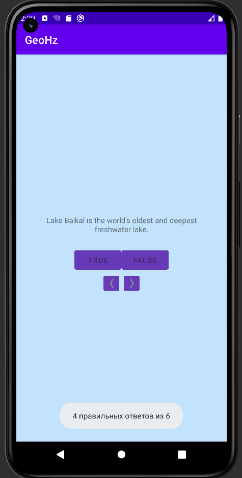

МИНИСТЕРСТВО НАУКИ И ВЫСШЕГО ОБРАЗОВАНИЯ
РОССИЙСКОЙ ФЕДЕРАЦИИ
ФЕДЕРАЛЬНОЕ ГОСУДАРСТВЕННОЕ БЮДЖЕТНОЕ
ОБРАЗОВАТЕЛЬНОЕ УЧРЕЖДЕНИЕ ВЫСШЕГО ОБРАЗОВАНИЯ
«САХАЛИНСКИЙ ГОСУДАРСТВЕННЫЙ УНИВЕРСИТЕТ»

      

 Институт естественных наук и техносферной безопасности   Кафедра информатики   Пашаян Самвел Алексанович 

   

 Лабораторная работа №3   «Жизненный цикл activity»   01.03.02 Прикладная математика и информатика

            

 Научный руководитель  
Соболев Евгений Игоревич

   

  г. Южно-Сахалинск   2023г. 

***
# 
 1.Предотвращение ввода нескольких ответов. 

После того как пользователь введет ответ на вопрос, заблокируйте кнопки этого вопроса, чтобы предотвратить возможность ввода нескольких ответов. 
***
## 
 РЕШЕНИЕ 

Для решения данной задачи, я добавил в классе Question еще одно поле "EnableButton" (по умолчанию True)

            data class Question(@StringRes val textResId: Int, val answer: Boolean, var enableButton:Boolean=true)
это поле будет отвечать, за то, ответил пользователь на вопрос или нет. При клике на кнопку "True/False" это значение будет менятся на false и кнопки будут неактивными

            true_button.setOnClickListener {
                checkAnswer(true)
                questionBank[currentIndex].enableButton=false
                true_button.setEnabled(questionBank[currentIndex].enableButton)
                false_button.setEnabled(questionBank[currentIndex].enableButton)
            }

В методе ниже "UpdateQuestions" кнопки будут принимать состояние переменной enableButton 

            private fun updateQuestion() {
                val questionTextResId = questionBank[currentIndex].textResId
                questionTextView.setText(questionTextResId)

                true_button.setEnabled(questionBank[currentIndex].enableButton)
                false_button.setEnabled(questionBank[currentIndex].enableButton)
            }

# 
 2.Вывод оценки. 

После того как пользователь введет ответ на все вопросы, отобразите уведомление с процентом правильных ответов. 
***
## 
 РЕШЕНИЕ 

Я добавил переменную private var resultPoint=0, куда будут записываться правильные ответы в методе CheckAnswer

        private fun checkAnswer(userAnswer: Boolean) {
            val correctAnswer = questionBank[currentIndex].answer
            val messageResId = if (userAnswer == correctAnswer) {
                R.string.correct_toast
            } else {
                R.string.incorrect_toast
            }
            Toast.makeText(this, messageResId, Toast.LENGTH_SHORT)
                .show()

            if (userAnswer == correctAnswer) {
                resultPoint+=1
            }
        }

Также не обойтись без метода "ShowAnswer" , который вызывается при клике на одну из кнопок ответа

            private fun ShowAnswer(){
                for( (index, element) in questionBank.withIndex()){
                    if (questionBank[index].enableButton==true){return}

                }
                    Toast.makeText(this, resultPoint.toString()+" правильных ответов из 6", Toast.LENGTH_SHORT)
                        .show()

            }

Если у всех вопросов поле enableButton==false то всплывает Toast с кол-вом правильных ответов

## 
 ВЫВОД 
      
Итогом работы стало создание Android приложения, которое предотвращает ввод нескольких ответов и выводит уведомление с процентом правильных ответов. Это позволяет сделать вывод, что цель данной лабораторной работы успешно достигнута
***    
